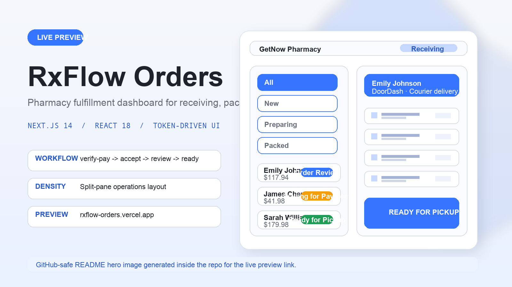

# Pharmacist Fulfillment

<p align="center">
  <a href="public/readme/getnow-preview.webm">
    
  </a>
</p>

<p align="center">
  <a href="https://rxflow-orders.vercel.app/"><strong>Live Preview</strong></a>
  ·
  <a href="public/readme/getnow-preview.webm"><strong>Demo Video (.webm)</strong></a>
</p>

Pharmacist Fulfillment is a Next.js pharmacy-order operations demo. Inside the UI it is branded as **RxFlow Orders**: a dense split-pane dashboard for receiving, reviewing, packing, and dispatching medication orders with strong visual hierarchy and a token-driven design system.

## Highlights

- Split view layout with an order list on the left and a workflow detail panel on the right
- Incoming-order simulation loop that creates new demo orders from seeded templates
- Barcode packing modal that simulates randomized scan order before an order can move to pickup or delivery
- Payment-verification lock, delivery countdowns, and delivered-hold auto-completion timers
- Three-layer design-token pipeline authored in TypeScript and rendered to generated CSS variables
- Standalone design catalog in [`dashboard-design-system.html`](dashboard-design-system.html)

## Stack

- Next.js 14 App Router
- React 18
- TypeScript
- Local `useReducer` store in [`src/store/orderStore.ts`](src/store/orderStore.ts)
- CSS custom properties generated from token maps in [`src/lib/tokens`](src/lib/tokens)
- Vercel Analytics and Microsoft Clarity in [`src/app/layout.tsx`](src/app/layout.tsx)

## Project Structure

```text
.
├── dashboard-design-system.html   # Standalone design catalog / specimen library
├── catalog-sync.md                # Notes for keeping catalog and app aligned
├── docs/
│   └── barcode-scanning-ux-pattern.md
├── public/
│   └── getnow.svg
├── scripts/
│   └── render-token-css.cjs       # Generates src/app/tokens/*.css from TS token maps
├── src/
│   ├── app/
│   │   ├── layout.tsx
│   │   ├── page.tsx
│   │   ├── globals.css
│   │   └── tokens/                # Generated CSS variable layers
│   ├── components/
│   │   ├── Dashboard.tsx
│   │   ├── detail/
│   │   ├── layout/
│   │   ├── list/
│   │   ├── modals/
│   │   └── ui/
│   ├── lib/
│   │   ├── data.ts
│   │   ├── types.ts
│   │   ├── utils.ts
│   │   └── tokens/
│   └── store/
│       └── orderStore.ts
├── skill.md
└── skill-ui-design.md
```

## Runtime Architecture

The app renders a single dashboard page from [`src/app/page.tsx`](src/app/page.tsx), which mounts [`src/components/Dashboard.tsx`](src/components/Dashboard.tsx). `Dashboard` owns the app-level side effects:

- a 1-second reducer tick for delivery and completion timers
- a repeating incoming-order demo loop
- the barcode scanning demo loop
- toast enter/leave timing

Application state lives in [`src/store/orderStore.ts`](src/store/orderStore.ts). The reducer manages:

- order data and selection state
- filter/search state
- message sending
- reject/cancel flows
- prescription preview state
- incoming-order popup state
- barcode scanning state
- main action locks and payment verification locks

## Order Workflow

The UI models a linear fulfillment flow, but a few steps are implemented as reducer state plus modal side effects rather than direct button-to-status transitions:

```text
verify-pay -> accept -> review -> preparing -> ready -> deliver/handoff
deliver -> transit -> delivered-hold -> done
handoff -> delivered-hold -> done
```

Important behavior details:

- `verify-pay` is locked for 10 seconds before the unpaid order can be confirmed.
- `accept` opens the barcode workflow and moves the order into the passive `review` state.
- `review` is not a manual action; the barcode modal drives the order forward.
- Once all items are scanned and confirmed, the order becomes `ready` and switches to `deliver` for courier orders or `handoff` for pickup orders.
- Courier deliveries auto-transition from `transit` to `delivered-hold` after 30 seconds.
- Delivered orders auto-transition to `completed` / `done` after 30 minutes if no issue is reported.
- The `complete` action type exists in the type/config surface, but the current reducer flow auto-completes delivered orders instead of exposing a separate manual complete button.

## Design System

The styling model is built on a strict three-layer token pipeline:

```text
foundation.ts -> semantic.ts -> component.ts -> generateTokenCss.ts
-> scripts/render-token-css.cjs -> src/app/tokens/*.css -> src/app/globals.css
```

Rules enforced by the repo guidance:

- raw values belong in `foundation.ts`
- semantic aliases must reference `--f-*`
- component-scoped tokens must reference `--s-*` or `--f-*`
- component CSS in [`src/app/globals.css`](src/app/globals.css) should consume `--s-*` and `--c-*`, not raw values

The standalone catalog at [`dashboard-design-system.html`](dashboard-design-system.html) mirrors the app tokens and component patterns. Use [`catalog-sync.md`](catalog-sync.md) when syncing changes between the app and catalog.

## Local Development

```bash
npm install
npm run dev
```

Open [http://localhost:3000](http://localhost:3000).

Production preview: [https://rxflow-orders.vercel.app/](https://rxflow-orders.vercel.app/)

## Scripts

- `npm run tokens:css` regenerates `src/app/tokens/foundation.css`, `semantic.css`, and `component.css`
- `npm run dev` runs the Next.js dev server and regenerates token CSS first
- `npm run build` regenerates token CSS and runs a production build
- `npm run start` regenerates token CSS and starts the production server

## Verification

There is currently no automated test suite in the repo. The main verification path is:

```bash
npm run build
```

For design-sensitive work, also preview:

- the app in the browser
- the standalone catalog at [`dashboard-design-system.html`](dashboard-design-system.html)

## Reference Docs

- [`skill.md`](skill.md): implementation guide for maintainers and coding agents
- [`skill-ui-design.md`](skill-ui-design.md): UI-specific design-system guidance
- [`catalog-sync.md`](catalog-sync.md): app-to-catalog sync workflow
- [`docs/barcode-scanning-ux-pattern.md`](docs/barcode-scanning-ux-pattern.md): notes on previous barcode interaction patterns
